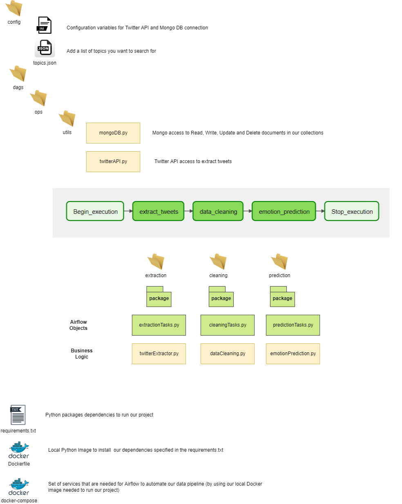

<!-- ABOUT THE PROJECT -->
# About The Project
Twitter Sentiment Analysis is a ML Pipeline whose aim is to predict the emotion of collected tweets based on several topics. This is an academic project.

## Table of Contents
<!-- TABLE OF CONTENTS -->
<details open="open">
  <summary>Table of Contents</summary>
  <ol>
    <li>
      <a href="#getting-started">Getting Started</a>
      <ul>
        <li><a href="#build-with">Built With</a></li>
        <li><a href="#architecture">Architecture</a></li>
        <li><a href="#installation">Installation</a></li>
        <li><a href="#content">Folder Structure</a></li>
        <li><a href="#screenshots">Screenshots</a></li>
        <li><a href="#mlflow">ML Flow</a></li>        
      </ul>
    </li>
  </ol>
</details>

<!-- GETTING STARTED -->
## Getting Started
The following instructions help you set up your project locally to execute the Data Pipeline in Airflow

### Build With
The ETL was developed with the following technologies:
  ```sh
  Docker 20.10.12
  Python 3.8
  ```
### Architecture
The following diagram explains how the ETl was developed in order to give an overview in case we might consider future changes



### Installation
1. Clone the repo (ssh or https)
   ```sh
   git clone git@github.com:Big-Data-Programming/big-data-programming-2-october-2020-lettuce-tweet.git   
   git clone https://github.com/Big-Data-Programming/big-data-programming-2-october-2020-lettuce-tweet.git

   ```

2. Fill in the configuration variables for the connectivity to both Twitter API and Mongo DB cluster.
    You can find that file under 'config/config.ini'


3. Set the list of topics you want to search for during the twitter extraction part
    You can find that file under 'config/topics.json'
    An example of the default topics is shown below:
    ```json
        "tags": [
                "#Anger",
                "#Sadness",
                "#Fury",
                "#Joy",
                "#Happiness"
            ]
   ```

4. Build the local docker image from `Dockerfile` within the current directory as follows:
   ```sh
   docker build . -f Dockerfile --tag airflow-local:0.1.1
   ```
5. (Only the first time) Initialize the airflow database in your system for the first time within the current directory
   ```sh
    docker-compose up airflow-init
   ```
6. Start the Docker containers to execute the pipeline within the current directory
   ```sh
    docker-compose up
   ```
7. Navigate to http://localhost:8080/

8. Login to the Airflow Admin Console by using the following credentials
   ```sh
    user: airflow
    password: airflow
   ```

9. Once logged in, you should see the console with the following view


10. Open the Dag called 'data-pipeline'


11. Execute the Dag as following:


### Content

```sh
  .
  ├── config
  │   └── config.ini
  │   └── topis.json
  ├── dags
  │   └── ops
  │       └── cleaning
  │             └── __init__.py
  │             └── cleaningTasks.py
  │             └── dataCleaning.py 
  │       └── extraction
  │             └── __init__.py
  │             └── extractionTasks.py
  │             └── twitterExtractor.py 
  │       └── prediction
  │             └── __init__.py
  │             └── emotionPrediction.py
  │             └── predictionTasks.py 
  │       └── utils
  │             └── __init__.py
  │             └── data-polarity.py
  │             └── mongoDB.py 
  │             └── twitterAPI.py 
  │   └── __init__.py
  │   └── etl.py
  ├── dataExtraction
  │    └── logs
  ├── logs
  │   └── dag_processor_manager
  │   └── data-pipeline
  │   └── scheduler
  ├── models
  │    └── assets
  │    └── my_model
  │    └── variables
  │   └── EmotionRecognitionV1.h5
  │   └── EmotionRecognitionV2.h5
  │   └── keras_metadata.pb
  │   └── ourModel
  │   └── ourModel2
  │   └── ourModel2.joblib
  │   └── ourModel2.pkl
  │   └── saved_model.pb
  ├── plugins
  │   └── 
  ├── screenshots
  │   └── Architecture.png
  │   └── Dags.png
  │   └── ETL.png
  │   └── RunDag.png
  │   └── staging.png
  │   └── MLFlow-v2.png
  │   └── MLFLOW.png
  │   └── staging.png
  │   └── versions.png
  ├── .env  
  ├── .gitignore
  ├── Dockerfile
  ├── docker-compose.yaml
  ├── requirements.txt
  ├── requirementsAirflow.txt
  └── README.md
  
    
```

## ML Flow

### Local Environment

1. Create a Virtual Enviroment and turn it on:

```
python3 -m venv ENV 
source ENV/bin/activate 
```

2. Install all the requiremrnts:

```
pip install -r requirements_mlf_local.txt 
```

3. Navigate to the dataExtraction folder

```
cd dataExtraction
```

4. 1st Terminal, run the model

```
python3 emotionv2.py
```

5. 2nd Terminal, Store all the artifacts into the sqlite:

```
mlflow ui --backend-store-uri sqlite:///mlflow.db
```

6. Watch the ML Flow UI:

```
http://127.0.0.1:5000
```

7. 3rd Terminal, Find the Model-Run-ID from the UI and replace it with the below <Model-Run-ID> and run it.

```
mlflow models serve -m ./mlruns/0/<Model-Run-ID>/artifacts/model -p 4321 
```


8. 4th Terminal, using the model for prediction. When you run your model with different Hyperparameters, you will get different versions of your model with different Accuracy and Loss. 

    Select your desired model for next step to use it in Staging or Production.


9. In our program the Stage is on Staging:


```
curl -X POST -H "Content-Type:application/json; format=pandas-split" --data '{"columns":<Tweeter Data>,"data":<Tweeter Data>}' http://127.0.0.1:4321/invocations 
``` 

### Docker

1. Build Docker image (within dataExtraction folder)

```
docker build . --tag mlflow-local:0.0.1
```

2. Run the Docker image

```
docker run -d -p 5000:6000 -p 4321:4321  mlflow-local:0.0.1
```

3. Open a terminal in that container and run this py script:
```
python3 emotion.py
```

4. Open a terminal in that container and run this script:
```
mlflow ui --backend-store-uri sqlite:///mlflow.db --host 0.0.0.0 --port 6000
```

5. Promote your model to "Staging" by logging into:

```
http://localhost:5000
```

6. Open a terminal in that container and run this script:

```
mlflow models serve -m ./mlruns/0/<MODEL_RUN_ID>>/artifacts/model -p 4321 -h 0.0.0.0
```
